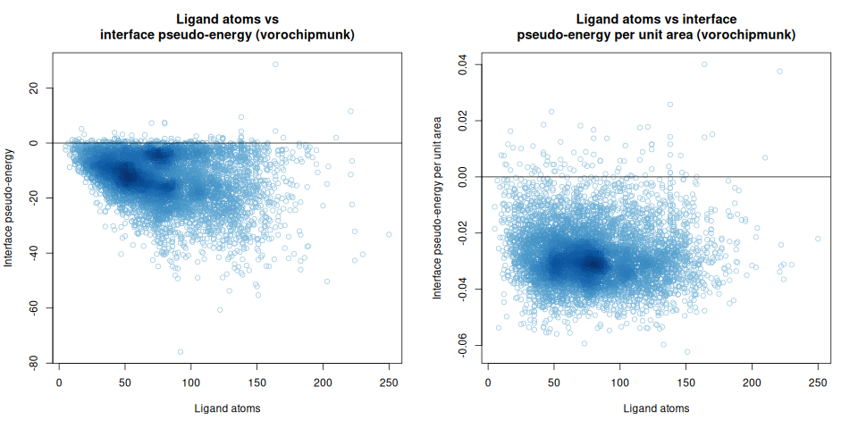
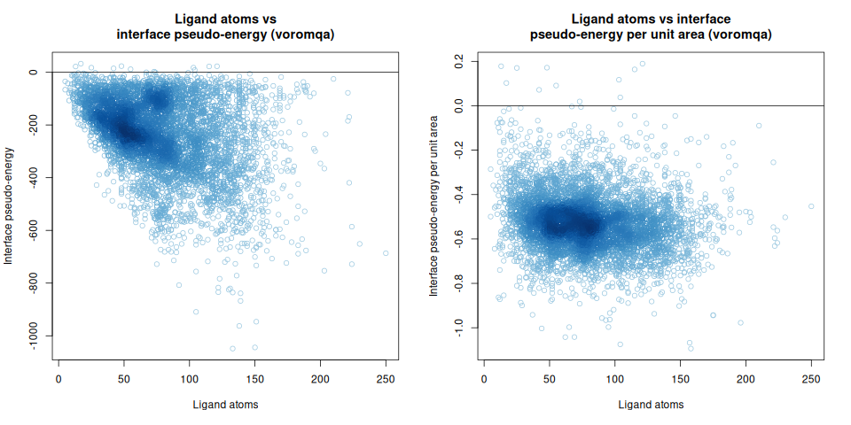
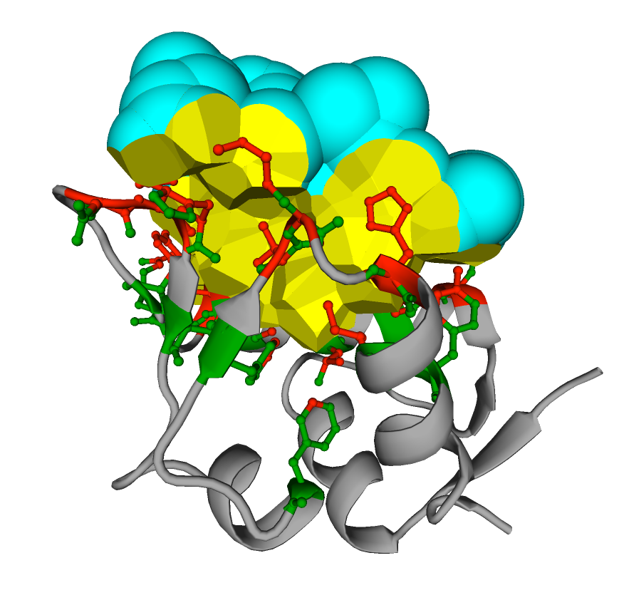

# About VoroNikon

VoroNikon is method to calculate area statistical pseudo-energy of interfaces for protein complexes
with peptides that can contain non-canonical amino acid residues.
VoroNikon uses a knowledge-based statistical potential defined for Voronoi tessellation-based contact areas of protein-protein interfaces.
There are two scoring modes - default one is based on the VoroChipmunk scoring method, another mode is based on the VoroMQA method.

This repository provides an alpha version of VoroNikon app.

# Obtaining and setting up VoroNikon

## Getting the latest version

The currently recommended way to obtain VoroNikon is cloning the VoroNikon git repository [https://github.com/kliment-olechnovic/voronikon](https://github.com/kliment-olechnovic/voronikon):

```bash
git clone https://github.com/kliment-olechnovic/voronikon.git
cd ./voronikon
```

## Setting up an environment for running VoroNikon

VoroNikon comes with a statically built 'voronota-js' and 'Knodle' binaries for Linux in the 'tools' subdirectory.

The source code for 'voronota-js' is also included, and can be used to build 'voronota-js' with the following command: 

```bash
./tools/build-voronota-js.bash
```

Sadly, [Knodle](https://team.inria.fr/nano-d/software/knodle/) is closed-sourced, and the latest available version of Knodle only runs on Linux.
Thus, the current version of VoroNikon will only run on Linux.

VoroNikon does not require any setup apart from an optional rebuilding of 'voronota-js' binary in the 'tools' subdirectory.


# Running the VoroNikon command-line tool

The overview of command-line options, as well as input and output, is printed when running the "voronikon" executable with "--help" or "-h" flags:

```bash
./voronikon --help

./voronikon -h
```

The following is the help message output:

```

'voronikon' script calculates inter-chain interfaces area statistical pseudo-energy
for protein complexes with peptides that can contain non-canonical amino acid residues.

Options:
    --input-receptor              string  *  input file path for receptor, must be in PDB or mmCIF format
    --input-ligand                string  *  input file path for ligand, must be in SDF format
    --output-table-file           string     output table file path, default is '_stdout' to print to stdout
    --output-details-dir          string     output directory path for details, default is '' to not output details
    --scoring-mode                string     scoring mode, can be 'voromqa' or 'vorochipmunk', default is 'vorochipmunk'
    --print-mode                  string     printing to stdout mode, can be 'h' or 'v', default is 'h'
    --help | -h                              flag to display help message and exit

Standard output:
    space-separated table of scores
    
Examples:

    voronikon --input-receptor "./receptor.pdb" --input-ligand "./ligand.sdf"
    
    voronikon --input-receptor "./receptor.pdb" --input-ligand "./ligand.sdf" --print-mode v
    
    voronikon --input-receptor './receptor.pdb" --input-ligand "./ligand.sdf" --output-table-file "./results.txt"

    voronikon --input-receptor "./receptor.pdb" --input-ligand "./ligand.sdf" --scoring-mode "voromqa"

```

# Output example

## In VoroChipmunk (default) mode

Running

```bash
./voronikon \
  --input-receptor ./tests/input/receptor.pdb \
  --input-ligand ./tests/input/ligand.sdf \
  --print-mode v
```

gives

```
input_receptor                    receptor.pdb
input_ligand                      ligand.sdf
receptor_atoms                    681
ligand_atoms                      119
iface_area                        749.571
iface_energy_worst                -13.8093
iface_energy_best                 -31.4304
iface_area_canonical              629.014
iface_energy_canonical            -27.0334
iface_clash_score                 0
per_unit_area_iface_energy_worst  -0.0184229
scoring_mode                      vorochipmunk
```

## In VoroMQA mode

Running

```bash
./voronikon \
  --scoring-mode voromqa \
  --input-receptor ./tests/input/receptor.pdb \
  --input-ligand ./tests/input/ligand.sdf \
  --print-mode v
```

gives

```
input_receptor                    receptor.pdb
input_ligand                      ligand.sdf
receptor_atoms                    681
ligand_atoms                      119
iface_area                        749.662
iface_energy_worst                -407.047
iface_energy_best                 -582.603
iface_area_canonical              629.189
iface_energy_canonical            -452.198
iface_clash_score                 0
per_unit_area_iface_energy_worst  -0.542974
scoring_mode                      voromqa
```

# Interpreting VoroNikon scores

Lower pseudo-energies are better.

VoroChipmunk and VoroMQA modes output pseudo-energies on different scales, they cannot be directly summed.

Right now VoroNikon can be used for ranking protein-peptide complexes, but interpreting the output scores in an absolute manner requires benchmarking.
One way to benchmark is to score protein-peptide complexes from PDB.
For 5159 non-redundant protein-peptide interfaces selected using [PPI3D clusters page](https://bioinformatics.lt/ppi3d/clusters)
with the parameters listed [here](benchmark/ppi3d_peptides/input/ppi3d_9d29a2d46eaf6d2d59bd93bc1f4158e6.json),
the scores are the following:





# How it works

VoroNikon uses generalized typing of atoms provided by Knodle to score contact areas that are similar to contact areas in proteins.
Basically, it transfers previously defined protein-protein contact area-based pseudo-energy scoring functions to protein-peptide scoring.

However, not all atoms in non-canonical amino acids can be straightforwardly mapped to protein atoms.
When such atoms are present in the ligand, VoroNikon explores all possible atom type mappings and outputs the worst and the best interface pseudo-energy scores.

Because of the current naive implementation of the exploration, VoroNikon may run several times slower than the VoroChipmunk and VoroMQA methods - the speed will hopefully be improved in the future.

VoroNicon scores only protein-ligand interface area. An example of such interface area is shown in yellow in the picture below:



