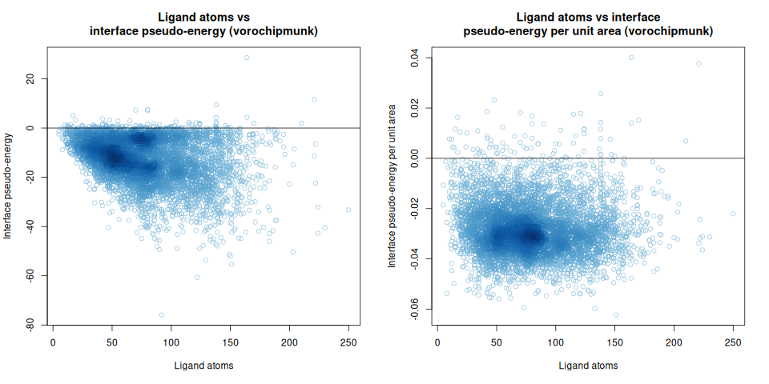
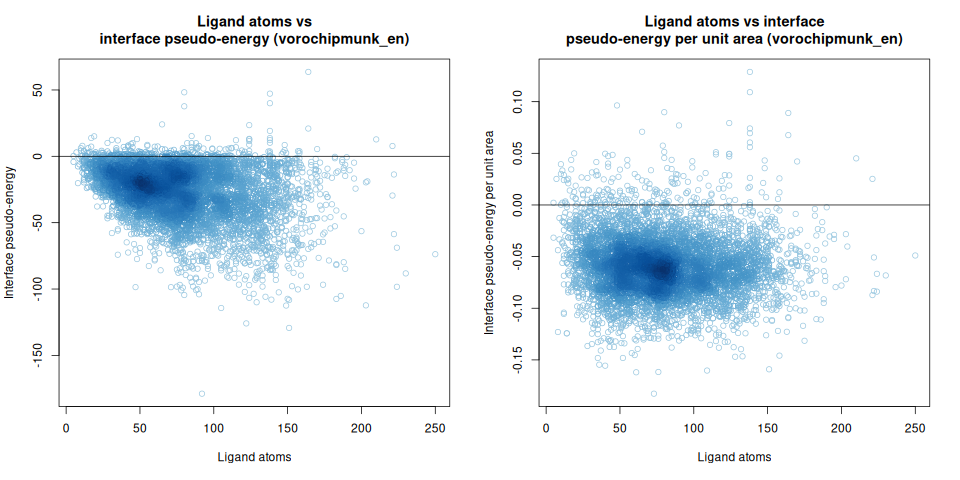
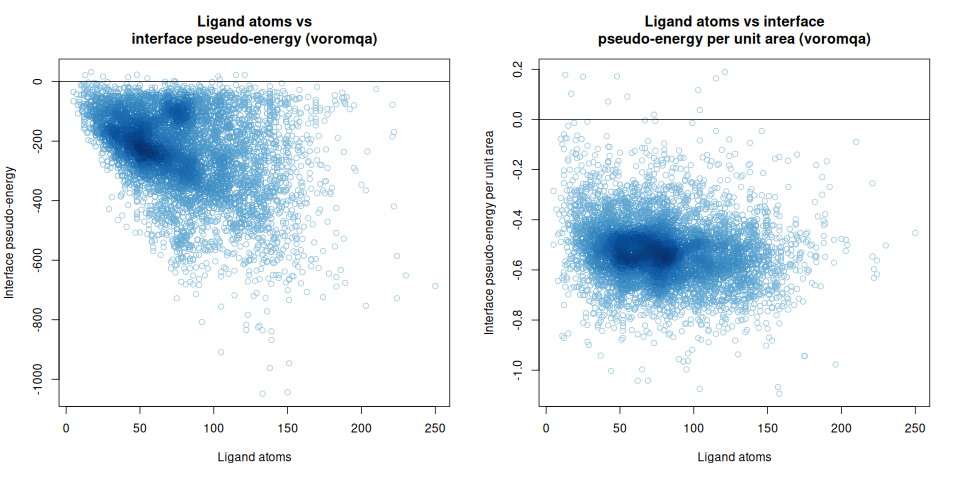
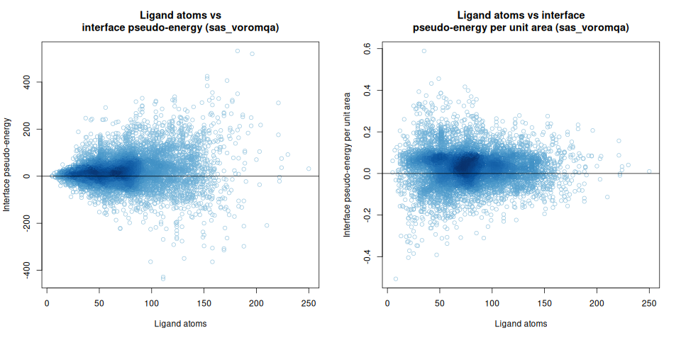
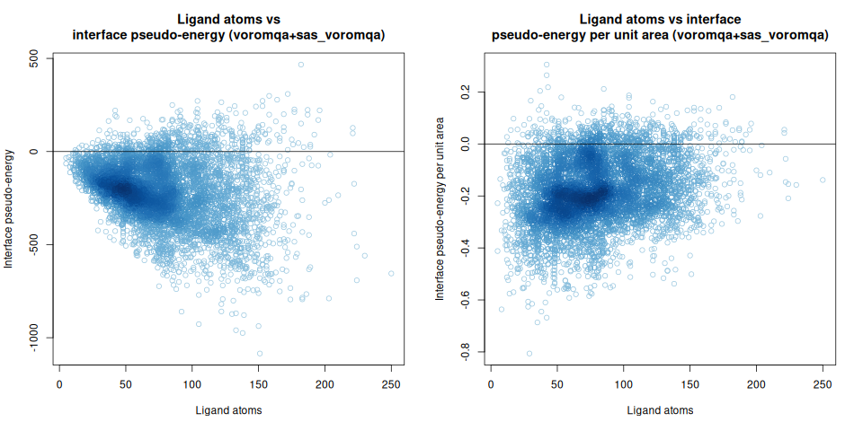
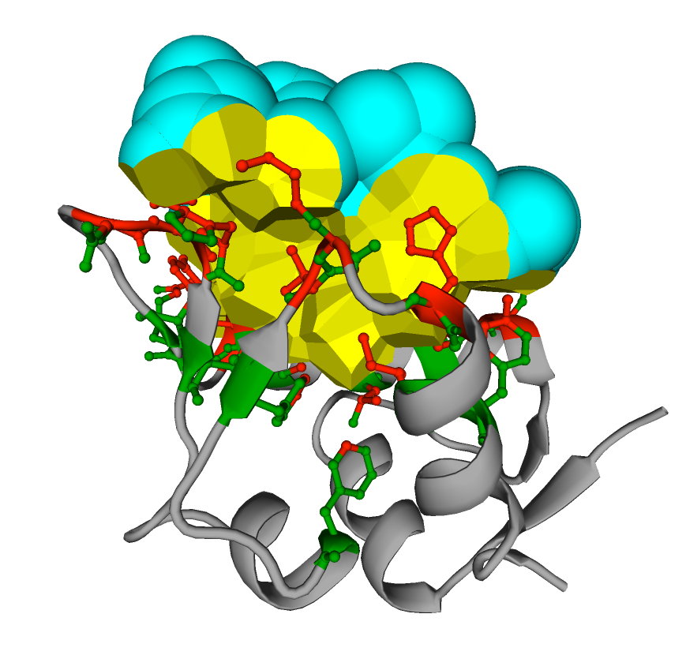

# About VoroNikon

VoroNikon is a method to calculate area statistical pseudo-energy of interfaces for protein complexes
with peptides that can contain non-canonical amino acid residues.
VoroNikon uses a knowledge-based statistical potential defined for Voronoi tessellation-based contact areas of protein-protein interfaces.
There are two scoring modes - default one is based on the VoroChipmunk scoring method, another mode is based on the VoroMQA method.

This repository provides an alpha version of VoroNikon app.

# Obtaining and setting up VoroNikon

## Getting the latest version

The currently recommended way to obtain VoroNikon is cloning the VoroNikon git repository [https://github.com/kliment-olechnovic/voronikon-app](https://github.com/kliment-olechnovic/voronikon-app):

```bash
git clone https://github.com/kliment-olechnovic/voronikon-app.git
cd ./voronikon-app
```

## Setting up an environment for running VoroNikon

VoroNikon comes with statically built 'voronota-js', 'voronota-lt' and 'Knodle' binaries for Linux in the 'tools' subdirectory.

The source code for 'voronota-js' and 'voronota-lt' is also included, and can be used to build 'voronota-js' and 'voronota-lt' with the following single command: 

```bash
./tools/build-all.bash
```

or with two separate commands:

```bash
./tools/build-voronota-js.bash
./tools/build-voronota-lt.bash
```

Note: [Knodle](https://team.inria.fr/nano-d/software/knodle/) is closed-sourced, and the latest available version of Knodle only runs on Linux.
Thus, the current version of VoroNikon will only run on Linux.

For basic use cases (i.e. scoring protein-ligand interfaces with the receptor and the ligand provided in separate files) VoroNikon does not require any setup apart from an optional rebuilding of 'voronota-js' and 'voronota-lt' binaries in the 'tools' subdirectory.

### Additional dependencies for some specific usecases

For using the `--input-complex` option, VoroNikon needs the `obabel` tool that is a part of the "Open Babel" software package.

For using the `--estimate-tolerance` option, VoroNikon needs "R".

Both "Open Babel" and "R" can be easily installed from standard repositories in most Linux distributions.


# Running the VoroNikon command-line tool

The overview of command-line options, as well as input and output, is printed when running the "voronikon" executable with "--help" or "-h" flags:

```bash
./voronikon --help

./voronikon -h
```

The following is the help message output:

```

'voronikon' script calculates inter-chain interfaces area statistical pseudo-energy
for protein complexes with peptides that can contain non-canonical amino acid residues.

Options:
    --input-receptor              string     input file path for receptor, must be in PDB or mmCIF format
    --input-ligand                string     input file path for ligand, must be in SDF format
    --input-complex               string     input file path for receptor+ligand complex input, must be in PDB or mmCIF format
    --scoring-mode                string     scoring mode in {'vorochipmunk', 'voromqa', 'sas_voromqa', 'vorochipmunk_en', 'all'}, default is 'vorochipmunk'
    --output-id                   string     string to use as the output ID, default is '' to not output any ID
    --output-table-file           string     output table file path, default is '_stdout' to print to stdout
    --output-details-dir          string     output directory path for details, default is '' to not output details
    --print-mode                  string     printing to stdout mode, can be 'h' or 'v', default is 'h'
    --estimate-tolerance                     flag to estimate pocket tolerance to all ligand atom types 
    --help | -h                              flag to display help message and exit

Standard output:
    space-separated table of scores
    
Examples:

    voronikon --input-receptor "./receptor.pdb" --input-ligand "./ligand.sdf"
    
    voronikon --input-receptor "./receptor.pdb" --input-ligand "./ligand.sdf" --print-mode v
    
    voronikon --input-receptor "./receptor.pdb" --input-ligand "./ligand.sdf" --output-table-file "./results.txt"

    voronikon --input-receptor "./receptor.pdb" --input-ligand "./ligand.sdf" --scoring-mode "voromqa"
    
    voronikon --input-complex "./complex.pdb" --print-mode v --scoring-mode "all" --output-id "test1"

```

# Output example

## In VoroChipmunk (default) mode

Running

```bash
./voronikon \
  --input-receptor ./tests/input/receptor.pdb \
  --input-ligand ./tests/input/ligand.sdf \
  --print-mode v
```

gives

```
input_receptor                    receptor.pdb
input_ligand                      ligand.sdf
receptor_atoms                    681
ligand_atoms                      119
iface_area                        749.571
iface_energy_worst                -13.8093
iface_energy_best                 -31.4304
iface_area_canonical              629.014
iface_energy_canonical            -27.0334
iface_clash_score                 0
per_unit_area_iface_energy_worst  -0.0184229
scoring_mode                      vorochipmunk
ligand_sasa                       895.386
ligand_volume                     3000.84
```

## In VoroMQA mode

Running

```bash
./voronikon \
  --scoring-mode voromqa \
  --input-receptor ./tests/input/receptor.pdb \
  --input-ligand ./tests/input/ligand.sdf \
  --print-mode v
```

gives

```
input_receptor                    receptor.pdb
input_ligand                      ligand.sdf
receptor_atoms                    681
ligand_atoms                      119
iface_area                        749.662
iface_energy_worst                -407.047
iface_energy_best                 -582.603
iface_area_canonical              629.189
iface_energy_canonical            -452.198
iface_clash_score                 0
per_unit_area_iface_energy_worst  -0.542974
scoring_mode                      voromqa
ligand_sasa                       895.386
ligand_volume                     3000.84
```

## In all scoring modes

Running

```bash
./voronikon \
  --scoring-mode all \
  --input-receptor ./tests/input/receptor.pdb \
  --input-ligand ./tests/input/ligand.sdf \
  --print-mode v
```

gives output with scores calculated using 4 scoring modes ('vorochipmunk', 'voromqa', 'sas_voromqa', 'vorochipmunk_en'):

```
input_receptor                                    receptor.pdb
input_ligand                                      ligand.sdf
receptor_atoms                                    681
ligand_atoms                                      119
iface_clash_score                                 0
scoring_mode                                      all
vorochipmunk_iface_area                           749.571
vorochipmunk_iface_energy_worst                   -13.8093
vorochipmunk_iface_energy_best                    -31.4304
vorochipmunk_iface_area_canonical                 629.014
vorochipmunk_iface_energy_canonical               -27.0334
vorochipmunk_per_unit_area_iface_energy_worst     -0.0184229
voromqa_iface_area                                749.662
voromqa_iface_energy_worst                        -407.047
voromqa_iface_energy_best                         -582.603
voromqa_iface_area_canonical                      629.189
voromqa_iface_energy_canonical                    -452.198
voromqa_per_unit_area_iface_energy_worst          -0.542974
sas_voromqa_iface_area                            895.386
sas_voromqa_iface_energy_worst                    174.605
sas_voromqa_iface_energy_best                     -81.1634
sas_voromqa_iface_area_canonical                  700.131
sas_voromqa_iface_energy_canonical                35.4416
sas_voromqa_per_unit_area_iface_energy_worst      0.195005
vorochipmunk_en_iface_area                        749.571
vorochipmunk_en_iface_energy_worst                -28.933
vorochipmunk_en_iface_energy_best                 -56.4093
vorochipmunk_en_iface_area_canonical              629.014
vorochipmunk_en_iface_energy_canonical            -58.6594
vorochipmunk_en_per_unit_area_iface_energy_worst  -0.0385994
ligand_sasa                                       895.386
ligand_volume                                     3000.84
```

# Interpreting VoroNikon scores

Lower pseudo-energies are better.

VoroChipmunk and VoroMQA modes output pseudo-energies on different scales, they cannot be directly summed.

Currently VoroNikon can be used for ranking protein-peptide complexes, but interpreting the output scores in an absolute manner requires benchmarking.
One way to benchmark is to score protein-peptide complexes from PDB.
For 5159 non-redundant protein-peptide interfaces selected using [PPI3D clusters page](https://bioinformatics.lt/ppi3d/clusters)
with the parameters listed [here](benchmark/ppi3d_peptides/input/ppi3d_9d29a2d46eaf6d2d59bd93bc1f4158e6.json),
the scores are the following:









## Note about 'voromqa' and 'sas_voromqa' scores

For a single protein-ligand complex, 'voromqa' and 'sas_voromqa' can be summed. Below is the plot of the summed scores:



# Combining VoroNikon scores

You cannot directly sum all the VoroNikon scores, even for the same single input complex.
But if you have scores for multiple models, you can convert the score column vectors to z-scores (a.k.a [Standard scores](https://en.wikipedia.org/wiki/Standard_score)), for example:

```
voromqa_zscore = ( voromqa_iface_energy_worst - mean(voromqa_iface_energy_worst) ) / standard_deviation(voromqa_iface_energy_worst)
```

Then you can sum the z-scores using different weights, for example:

```
weighted_combined_zscore = 0.5*vorochipmunk_zscore + 0.5*vorochipmunk_en_zscore + 1.0*voromqa_zscore
```

And then use the weighted combined z-score for ranking.


# How it works

VoroNikon uses generalized typing of atoms provided by Knodle to score contact areas that are similar to contact areas in proteins.
Basically, it transfers previously defined protein-protein contact area-based pseudo-energy scoring functions to protein-peptide scoring.

However, not all atoms in non-canonical amino acids can be straightforwardly mapped to protein atoms.
When such atoms are present in the ligand, VoroNikon explores all possible atom type mappings and outputs the worst and the best interface pseudo-energy scores.

Because of the current naive implementation of the exploration, VoroNikon may run several times slower than the VoroChipmunk and VoroMQA methods - the speed will hopefully be improved in the future.

In the main scoring modes ('vorochipmunk', 'voromqa', 'vorochipmunk_en') VoroNicon scores only protein-ligand interface area.
An example of such interface area is shown in yellow in the picture below.
In the 'sas_voromqa' scoring mode VoroNicon scores only solvent-accessible surface area (cyan-colored surface in the picture below). 



